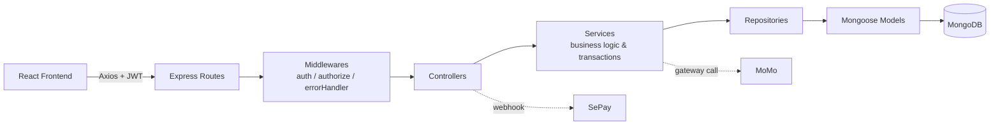
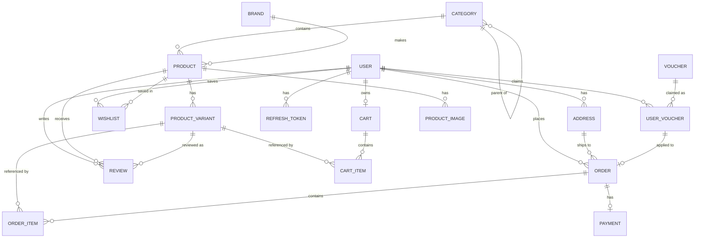
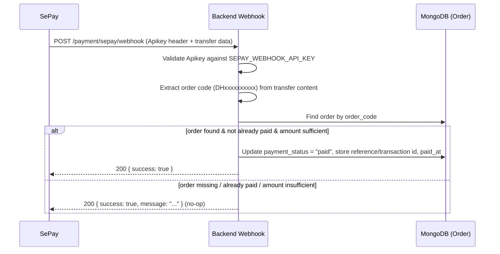

# PC Store

## 1. Project Overview

**PC Store** is a full-stack e-commerce web application for selling laptops and computer accessories, built as a single-store (non-marketplace) platform in the style of Shopee. It provides a customer-facing storefront for browsing, purchasing, and tracking laptop orders, plus a dedicated admin panel for managing catalog, orders, vouchers, and users.

The system is a **MERN-style stack** (MongoDB, Express, React, Node.js), split into two independently deployable apps:

- `frontend/` — a React (Vite) single-page application for customers and admins
- `backend/` — a Node.js/Express REST API following a layered Controller → Service → Repository → Model architecture

Its main purpose is to demonstrate a realistic, production-shaped e-commerce backend: product variants with per-configuration pricing/stock, cart and checkout, voucher discounts (product and shipping vouchers), order status lifecycle, JWT authentication with refresh-token rotation, and real payment-gateway integrations (SePay bank-transfer webhook, MoMo).

## 2. Features

### Customer features

- Browse products by category (with parent/child category tree) and brand
- View product detail with multiple configurations/variants (CPU, RAM, storage, GPU, screen), images, and reviews
- Add products to cart, update quantities, view a cart summary
- Manage shipping addresses, with a default address
- Checkout with voucher application (separate product-discount and shipping-discount vouchers)
- Pay via Cash on Delivery, bank transfer (SePay), or MoMo
- Track order status and order history; cancel a pending order
- Wishlist products
- Leave product/variant reviews and ratings
- Ask public questions about products/store (answered by admin)
- Submit contact messages to the store

### Admin features

- Dashboard with revenue chart, order chart, order-status breakdown, latest products, and top-selling products
- Product management: create/update/soft-delete products, manage variants (price, discount price, stock, specs) and product images (upload, set main image)
- Category management (create/update/delete, tree view)
- Brand management (create/update/delete, logo upload)
- Order management: view all orders, update order status, view order items
- Voucher management: create/update/delete product and shipping vouchers
- User management: list users, view user stats, add users, update user status
- Question management: view, reply to, hide, or delete customer questions
- Contact-message management (view, update status, delete)

### Authentication

- Registration and login with hashed passwords (`bcrypt`)
- JWT access tokens (8h expiry) and refresh tokens (3d expiry), with refresh tokens persisted in MongoDB and rotated on every refresh
- Logout invalidates the stored refresh token
- Role-based access control (`user` / `admin`) enforced via middleware

### Product management

- Products hold descriptive data only (name, slug, description, rating average, sold count, use case, status); every product has one or more **variants** that hold price, discount price, stock, and hardware specs
- Multiple images per product with a designated main image

### Category management

- Self-referencing category tree (`parent_id`) supporting nested categories

### Brand management

- Brand catalog with uploaded logo images

### Cart

- One cart per user, cart items reference a specific product variant and quantity, with an aggregated cart summary endpoint

### Orders

- Snapshot-based order items (product name, image, SKU, config name, and price are copied at purchase time, independent of later product changes)
- Stock validation and atomic stock deduction using MongoDB transactions
- Order status flow: `pending → confirmed → shipping → completed`, with `cancelled` as a terminal state that restores stock

### Payments

- **SePay** webhook integration: verifies an API-key header, parses the order code from the bank transfer content, and marks the matching order as paid
- **MoMo** payment gateway integration for generating a hosted payment URL

### Other features found in the source code

- Voucher system with two voucher types (`product`, `shipping`), percentage or fixed discounts, minimum order value, max discount cap, and per-user voucher claiming/usage tracking
- Soft-delete support for products (`mongoose-delete`)
- Pagination, search, and sorting helpers shared across list endpoints
- Server-rendered Handlebars views are configured on the backend (`express-handlebars`), alongside the primary JSON REST API

## 3. Tech Stack

### Frontend

- React 19 with `react-router-dom` v7 (client-side routing, nested/protected routes)
- Vite as the build tool and dev server
- Axios with request/response interceptors for JWT attachment and silent access-token refresh
- Sass (`.scss`) for styling
- `react-icons`

### Backend

- Node.js with Express 5
- Mongoose (MongoDB ODM), with `mongoose-delete` (soft delete) and `mongoose-slug-generator`
- `jsonwebtoken` for access/refresh tokens, `bcrypt` for password hashing
- `express-validator` for request validation
- `multer` for image uploads (brand logos, product images)
- `express-handlebars` for server-rendered views
- `axios` for outbound calls to the MoMo payment gateway
- `cors`, `morgan` (HTTP logging), `method-override`

### Database

- MongoDB, accessed through Mongoose ODM

### Deployment

- Frontend: Vercel (SPA rewrite configuration in `vercel.json`)
- Backend: Render

## 4. System Architecture

The backend follows a layered architecture. A request travels through:

```
Frontend (React)
   → REST API (Express routes)
   → Controller
   → Service (business logic, validation, transactions)
   → Repository (Mongoose queries)
   → Model (Mongoose schema)
   → MongoDB
```

- **Routes** map HTTP verbs/paths to controller methods and attach `auth`/`authorize` middleware.
- **Controllers** parse the request, call the corresponding service, and shape the HTTP response.
- **Services** contain business rules — stock checks, voucher calculation, order-total calculation, MongoDB transactions for order creation/cancellation.
- **Repositories** are the only layer that talks to Mongoose models directly, keeping query logic out of services.
- **Models** define Mongoose schemas, indexes, and (for `Product`) the soft-delete plugin.



## 5. Project Structure

```
website-laptop/
├── frontend/
│   ├── src/
│   │   ├── pages/            # Home, Product, Cart, Checkout, Payment, Profile, Voucher, Contact...
│   │   ├── admin/             # Dashboard, product/category/brand/voucher/user management, questions
│   │   ├── layouts/           # MainLayout, AdminLayout
│   │   ├── components/        # layout/ (Header, Footer), common/
│   │   ├── errors/             # 401, 403, 404, 500, Network, Maintenance, Session pages
│   │   ├── utils/              # axiosInstance.js (JWT interceptor), ProtectRoute.jsx
│   │   └── App.jsx             # route definitions
│   ├── vite.config.js
│   └── vercel.json
│
└── backend/
    └── src/
        ├── app/
        │   ├── controllers/    # one controller per resource (Product, Order, Payment, Voucher...)
        │   ├── services/       # business logic, e.g. OrderService, VoucherService, PaymentService
        │   ├── repositories/   # Mongoose data access layer
        │   ├── models/         # Mongoose schemas (User, Product, ProductVariant, Order...)
        │   ├── middlewares/    # auth.js, authorize.js, errorHandler.js
        │   ├── gateway/        # MomoGateway.js
        │   └── utils/          # AppError.js
        ├── routes/             # Express routers per resource + routes/index.js
        ├── helpers/            # filtering, pagination, sorting, validation
        ├── config/db/          # Mongoose connection
        ├── public/             # uploaded brand/product images (served as static files)
        └── index.js            # app entry point
```

## 6. Frontend Architecture

- **React + `react-router-dom` v7**, with a `createBrowserRouter`/`createRoutesFromElements` route tree defined in `App.jsx`.
- **Layouts**: `MainLayout` wraps the public storefront (header/footer + nested pages such as `Home`, `Product`, `Cart`, `Checkout`, `Payment`, `Voucher`, `Contact`, and the `account` profile section); `AdminLayout` wraps all `/admin/*` pages (Dashboard, product/category/brand/voucher/user management, questions).
- **Protected routes**: `utils/ProtectRoute.jsx` reads the logged-in user from `localStorage`, redirects unauthenticated users to `/login`, and can additionally restrict a route subtree to specific roles via an `allowedRoles` prop (used to gate the entire `/admin` tree to `role === "admin"`).
- **API communication**: a shared `axiosInstance` (in `utils/axiosInstance.js`) attaches the JWT access token from `localStorage` to every outgoing request via a request interceptor.
- **Authentication handling / silent refresh**: a response interceptor catches `401`/`403` responses, calls `POST /auth/refresh-token` with the stored refresh token, stores the new tokens, and retries the original request; if the refresh call also fails, local storage is cleared and the user is redirected to `/403`.
- **Error pages**: dedicated `401`, `403`, `404`, `500`, `Network`, `Maintenance`, and `Session` pages under `src/errors/`.
- **Modules**: `pages/Toast` provides app-wide toast notifications (`ToastContainer` mounted at the root of `App.jsx`); `pages/LoginRequiredModal.jsx` prompts guests to log in from guest-accessible pages such as product detail.

## 7. Backend Architecture

- **Express application** (`src/index.js`) sets up CORS, JSON/urlencoded body parsing, `method-override`, `morgan` request logging, a Handlebars view engine, static file serving for `src/public`, and mounts all routers via `routes/index.js` before a global `errorHandler`.
- **Routes** are grouped by resource (`/auth`, `/user`, `/product`, `/category`, `/brand`, `/cart`, `/cart-item`, `/order`, `/order-item`, `/voucher`, `/review`, `/payment`, `/admin`, `/wishlist`, `/contact`, `/question`, `/product-image`, `/product-variant`, `/address`).
- **Controllers** validate input (via `express-validator` results), delegate to services, and return a JSON response.
- **Services** hold the business logic — for example, `OrderService.createOrder` validates the cart, checks stock, applies at most one product voucher and one shipping voucher, computes totals, and creates the order + order items inside a MongoDB transaction, decrementing stock atomically.
- **Repositories** wrap Mongoose queries (find/create/update/aggregate) for each model, keeping services persistence-agnostic.
- **Middlewares**:
  - `auth.js` verifies the `Authorization: Bearer <token>` JWT against `ACCESS_TOKEN_SECRET` and attaches the decoded payload to `req.user`.
  - `authorize(...roles)` checks `req.user.role` against an allow-list and returns `403` if not permitted.
  - `errorHandler.js` is a centralized Express error handler that logs the failing request/stack and returns a JSON error response (including the stack trace only when `NODE_ENV=development`).
- **Typical request flow**: `Route → auth (optional) → authorize (optional) → validator (optional) → Controller → Service → Repository → Model → MongoDB → JSON response`.

## 8. Authentication & Authorization

- **Register** (`POST /auth/register`) and **Login** (`POST /auth/login`) are validated with `express-validator`; passwords are hashed with `bcrypt` before being stored.
- **JWT access token**: signed with `ACCESS_TOKEN_SECRET`, expires in **8 hours**.
- **Refresh token**: signed with `REFRESH_TOKEN_SECRET`, expires in **3 days**, and is persisted in a `RefreshToken` MongoDB collection.
- **Token refresh flow** (`POST /auth/refresh-token`): the submitted refresh token is looked up in the database, verified, and — if valid — the old token is deleted and a new access/refresh token pair is issued and stored (rotation).
- **Logout** (`POST /auth/logout`, requires auth) deletes the caller's stored refresh token.
- **Role-based authorization**: the `authorize(...roles)` middleware restricts endpoints to specific roles (`user`, `admin`); most catalog-mutating and dashboard endpoints require `admin`.
- **Protected routes**: on the frontend, `ProtectRoute` blocks unauthenticated access to account and checkout pages, and restricts `/admin/*` to users with `role === "admin"`.

## 9. Database Design

MongoDB collections (Mongoose models) and their key relationships:

- **User** — account with `username`, `email`, `phone`, hashed `password`, `role` (`user`/`admin`), `status`
- **RefreshToken** — `user_id → User`, stores active refresh tokens
- **Address** — `user_id → User`; delivery addresses, one can be `is_default`
- **Category** — self-referencing `parent_id → Category` for a category tree
- **Brand** — brand name, slug, logo
- **Product** — `category_id → Category`, `brand_id → Brand`; descriptive fields only (soft-deletable)
- **ProductVariant** — `product_id → Product`; SKU, config name, specs (CPU/RAM/storage/GPU/screen), `price`, `discount_price`, `stock`, `status`
- **ProductImage** — `product_id → Product`; image URL and `is_main` flag
- **Review** — `product_id → Product`, `variant_id → ProductVariant`, `user_id → User`; rating and comment
- **Wishlist** — `user_id → User`, `product_id → Product` (unique pair)
- **Cart** — one per `user_id → User`
- **CartItem** — `cart_id → Cart`, `variant_id → ProductVariant`, `quantity`
- **Voucher** — `voucher_type` (`product`/`shipping`), `discount_type` (`percent`/`fixed`), validity window, usage limit
- **UserVoucher** — `user_id → User`, `voucher_id → Voucher`; tracks a claimed voucher's `available`/`used` status
- **Order** — `user_id → User`, `address_id → Address`, `product_user_voucher_id`/`shipping_user_voucher_id → UserVoucher`; amounts, `status`, `payment_method`, `payment_status`, SePay/MoMo references
- **OrderItem** — `order_id → Order`, `product_id → Product`, `variant_id → ProductVariant`; a purchase-time snapshot of name/image/SKU/config/price
- **Payment** — `order_id → Order` (unique); MoMo `method`, `status`, `transaction_id`
- **Question** — `user_id → User`; customer question with optional `admin_reply`
- **ContactMessage** — optional `user_id → User`; name/email/phone/message with a status



## 10. Core Business Logic

- **Product variants**: every product's price and stock live exclusively on its `ProductVariant` documents, so one product can offer several configurations (CPU/RAM/storage combinations) with independent pricing and stock.
- **Pricing & discounts**: each variant has an optional `discount_price`; `OrderService` computes `subtotal` from the base `price` and `product_discount` from the difference between `price` and `discount_price` across all ordered quantities.
- **Inventory/stock**: stock is validated before checkout (`variant.status === "active"` and `quantity <= stock`), decremented atomically inside the order-creation transaction, and restored when an order is cancelled.
- **Cart calculations**: `CartItemController`/`Service` expose a cart summary endpoint that aggregates item subtotals for the cart.
- **Order creation**: implemented as a single MongoDB transaction that validates the selected cart items, applies at most one product voucher and one shipping voucher, computes the final total, creates the `Order` and its `OrderItem` snapshots, marks used vouchers, decrements stock, and clears the purchased cart items — rolling back entirely on any failure.
- **Order status flow**: updating an order to `completed` increments each product's `sold_count`; updating to `cancelled` restores the ordered stock; a `completed` order cannot be moved to any other status.
- **Voucher handling**: vouchers are split into `product` (percentage or fixed discount on merchandise total, capped by `max_discount`) and `shipping` (percentage or fixed discount on the shipping fee) types, each gated by an active date range, `status`, and a minimum order value; a user must claim a voucher (`UserVoucher`) before it can be applied to an order, and it is marked `used` once consumed.
- **Payment processing**: orders can be paid via Cash on Delivery, bank transfer (verified through the SePay webhook), or MoMo (via a generated payment URL).

## 11. Order & Payment Flow

Order status lifecycle:

```
pending → confirmed → shipping → completed
   └────────────────→ cancelled
```

- Only a `pending` order can be cancelled by the customer (`OrderService.cancelOrder`); cancelling restores the reserved stock for each order item.
- `completed` is a terminal state — the status can no longer be changed once reached.

`payment_status` (`pending → paid`, or `failed` / `refunded`) is tracked independently of `status`, and is updated by:

- the **SePay webhook** for bank-transfer orders, or
- the **MoMo** payment flow, or
- an authenticated "mark as paid" endpoint used for other payment methods (e.g. COD confirmation).

**SePay webhook flow** (`POST /payment/sepay/webhook`):



The webhook only accepts incoming transfers (`transferType === "in"`), extracts an order code matching the pattern `DH<digits>` from the transfer content/description, and requires the transferred amount to be at least the order's `total_amount` before marking it paid.

## 12. API Overview

Base path: none of the routers are mounted under a shared `/api` prefix — each router is mounted directly at its resource root (e.g. `/product`, `/order`) by `routes/index.js`. 🔒 = requires a valid access token, 🔒👑 = requires an `admin` role.

### Authentication (`/auth`)

| Method | Endpoint              | Auth | Purpose                                       |
| ------ | --------------------- | ---- | --------------------------------------------- |
| POST   | `/auth/register`      | –    | Create a new account                          |
| POST   | `/auth/login`         | –    | Log in, receive access/refresh tokens         |
| POST   | `/auth/refresh-token` | –    | Exchange a refresh token for a new token pair |
| POST   | `/auth/logout`        | 🔒   | Invalidate the current refresh token          |

### Users (`/user`)

| Method      | Endpoint                      | Auth | Purpose                       |
| ----------- | ----------------------------- | ---- | ----------------------------- |
| GET         | `/user/me`                    | 🔒   | Get current user's profile    |
| PATCH / PUT | `/user/me`, `/user/update/me` | 🔒   | Update current user's profile |
| GET         | `/user/all`                   | 🔒   | List users                    |

### Products (`/product`)

| Method | Endpoint              | Auth | Purpose                         |
| ------ | --------------------- | ---- | ------------------------------- |
| GET    | `/product/all`        | –    | List products (filter/paginate) |
| GET    | `/product/slug/:slug` | –    | Product detail by slug          |
| GET    | `/product/:productId` | –    | Product detail by id            |
| GET    | `/product/bestseller` | 🔒   | Best-selling products           |
| POST   | `/product/add`        | 🔒👑 | Create product                  |
| PUT    | `/product/update/:id` | 🔒👑 | Update product                  |

### Product variants (`/product-variant`) & images (`/product-image`)

| Method | Endpoint                              | Auth | Purpose                     |
| ------ | ------------------------------------- | ---- | --------------------------- |
| GET    | `/product-variant/product/:productId` | 🔒   | List variants for a product |
| POST   | `/product-variant/add`                | 🔒👑 | Add a variant               |
| PUT    | `/product-variant/update/:id`         | 🔒👑 | Update a variant            |
| DELETE | `/product-variant/delete/:id`         | 🔒👑 | Delete a variant            |
| GET    | `/product-image/:productId`           | 🔒   | List images for a product   |
| POST   | `/product-image/add`                  | 🔒👑 | Upload product images       |
| PUT    | `/product-image/set-main/:id`         | 🔒👑 | Set main image              |

### Categories (`/category`) & Brands (`/brand`)

| Method | Endpoint               | Auth | Purpose                      |
| ------ | ---------------------- | ---- | ---------------------------- |
| GET    | `/category/:slug`      | 🔒   | Category detail by slug      |
| PUT    | `/category/update/:id` | –    | Update category              |
| GET    | `/brand/admin/all`     | –    | List brands                  |
| POST   | `/brand/admin/add`     | 🔒   | Add brand (with logo upload) |

### Cart (`/cart`, `/cart-item`)

| Method | Endpoint                     | Auth | Purpose                       |
| ------ | ---------------------------- | ---- | ----------------------------- |
| GET    | `/cart/my-cart/all`          | 🔒   | Get current user's cart items |
| POST   | `/cart-item/add`             | 🔒   | Add item to cart              |
| PUT    | `/cart-item/update/:id`      | 🔒   | Update item quantity          |
| DELETE | `/cart-item/delete/:id`      | 🔒   | Remove item                   |
| GET    | `/cart-item/summary/:cartId` | 🔒   | Cart totals summary           |

### Orders (`/order`)

| Method | Endpoint                                 | Auth | Purpose                                 |
| ------ | ---------------------------------------- | ---- | --------------------------------------- |
| GET    | `/order/my-orders`                       | 🔒   | Current user's orders                   |
| POST   | `/order/add`                             | 🔒   | Create order from cart items (checkout) |
| GET    | `/order/:id`                             | 🔒   | Order detail                            |
| PATCH  | `/order/:id/cancel`, `/order/cancel/:id` | 🔒   | Cancel a pending order                  |
| PATCH  | `/order/update/:id/status`               | 🔒   | Update order status                     |
| PATCH  | `/order/payment/:id`                     | 🔒   | Mark order as paid                      |

### Vouchers (`/voucher`)

| Method | Endpoint            | Auth | Purpose                          |
| ------ | ------------------- | ---- | -------------------------------- |
| GET    | `/voucher/active`   | –    | Active vouchers                  |
| GET    | `/voucher/my`       | 🔒   | Vouchers claimed by current user |
| POST   | `/voucher/claim`    | 🔒   | Claim a voucher                  |
| POST   | `/voucher/validate` | 🔒   | Validate a voucher for checkout  |

### Payments (`/payment`)

| Method | Endpoint                 | Auth            | Purpose                     |
| ------ | ------------------------ | --------------- | --------------------------- |
| POST   | `/payment/sepay/webhook` | Webhook API key | SePay transfer confirmation |

### Questions (`/question`) & Contact (`/contact`)

| Method | Endpoint                    | Auth | Purpose                    |
| ------ | --------------------------- | ---- | -------------------------- |
| POST   | `/question/add`             | 🔒   | Submit a question          |
| GET    | `/question/approved`        | –    | Public, answered questions |
| PATCH  | `/question/admin/:id/reply` | 🔒👑 | Admin reply                |
| POST   | `/contact-message/add`      | 🔒   | Submit a contact message   |

### Admin (`/admin`)

| Method | Endpoint                                                                | Auth | Purpose                          |
| ------ | ----------------------------------------------------------------------- | ---- | -------------------------------- |
| GET    | `/admin/dashboard`                                                      | 🔒👑 | Dashboard summary                |
| GET    | `/admin/revenue-chart`, `/admin/orders-chart`, `/admin/order-statistic` | 🔒👑 | Chart data                       |
| GET    | `/admin/orders`                                                         | 🔒👑 | All orders                       |
| PATCH  | `/admin/orders/:id/status`                                              | 🔒👑 | Update order status              |
| POST   | `/admin/products/add`                                                   | 🔒👑 | Create product with image upload |
| GET    | `/admin/products/all`                                                   | 🔒👑 | List products                    |
| POST   | `/admin/voucher/add`                                                    | 🔒👑 | Create voucher                   |
| GET    | `/admin/category/all/tree`                                              | –    | Category tree                    |

_(Not every trivial endpoint is listed above — see `backend/src/routes/` for the full set.)_

## 13. Environment Variables

```env
# Backend (.env)
SERVER_PORT=3000
APP_URL=http://localhost:3000
MONGO_URL=your_mongodb_connection_string
ACCESS_TOKEN_SECRET=your_access_token_secret
REFRESH_TOKEN_SECRET=your_refresh_token_secret
SEPAY_WEBHOOK_API_KEY=your_sepay_webhook_api_key
```

```env
# Frontend (.env)
VITE_APP_URL=http://localhost:3000
```

> Replace all placeholder values with your own secrets before running the project. Never commit a populated `.env` file.
