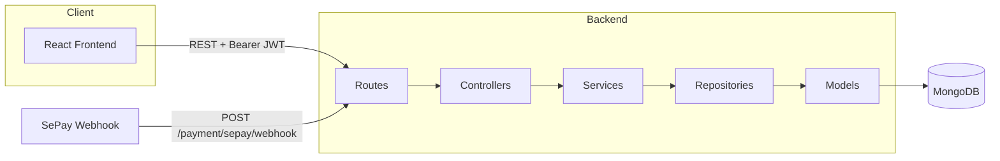
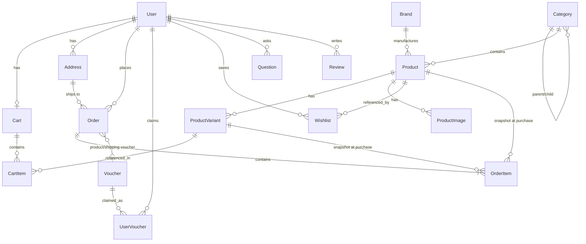
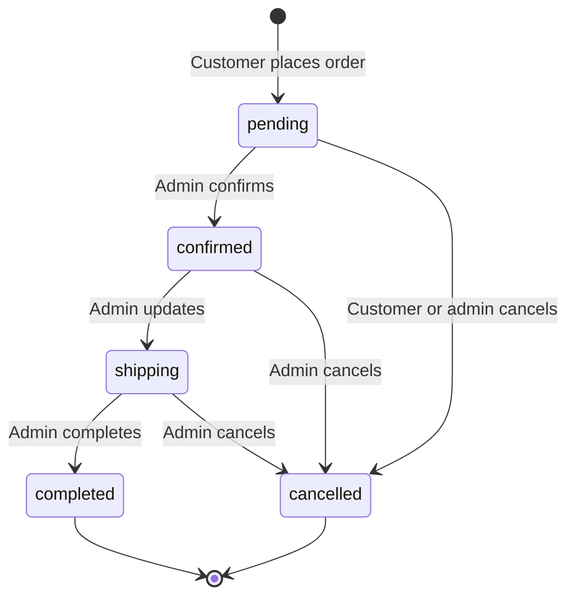
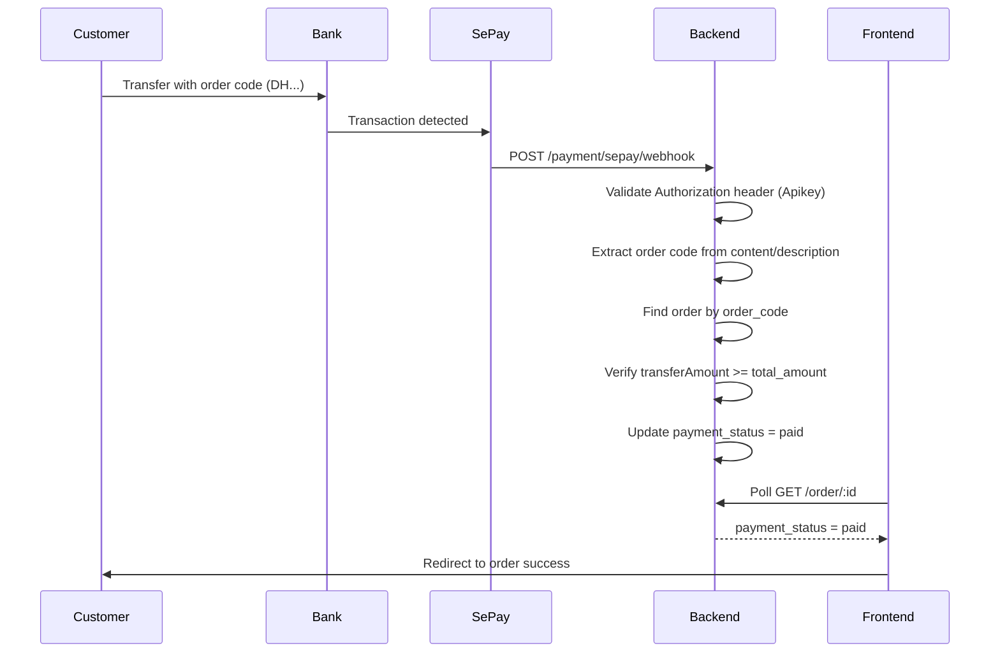

# PC Store

A full-stack e-commerce web application for selling laptops, PC components, and related computer products. PC Store provides a customer-facing storefront for browsing, cart management, checkout, and order tracking, plus an admin panel for catalog, order, user, and promotion management.

The system is built as a **React SPA** communicating with a **Node.js REST API**, backed by **MongoDB**.

---

## 1. Project Overview

**PC Store** is an online retail platform focused on computer hardware—primarily laptops and PC components. It solves the problem of selling products with multiple configuration variants (CPU, RAM, storage, GPU, screen size), each with its own price, discount, and stock level.

| Aspect                 | Description                                                                                                                                                                    |
| ---------------------- | ------------------------------------------------------------------------------------------------------------------------------------------------------------------------------ |
| **Application type**   | Full-stack e-commerce web application                                                                                                                                          |
| **Main purpose**       | Allow customers to browse products, manage carts, place orders, and pay online or on delivery; allow admins to manage catalog, orders, users, vouchers, and customer questions |
| **Architecture style** | Monorepo with separate `frontend/` and `backend/` packages                                                                                                                     |
| **API style**          | RESTful JSON API (routes mounted at the backend root, e.g. `/auth`, `/product`)                                                                                                |

---

## 2. Features

### Customer features

- Browse product variants on the home page with filters (use case, brand, price, CPU, RAM, storage, GPU, screen size, resolution, in-stock) and sorting
- View product detail pages with variant selection, images, pricing, and stock status
- Add products to cart and update quantities
- Checkout with shipping address selection, order notes, and payment method choice
- Claim and apply vouchers (separate product discount and shipping discount vouchers)
- View order history, order details, and cancel pending orders
- Manage profile information (username, phone)
- Manage saved delivery addresses (add, edit, delete, set default)
- Wishlist (add/remove products, view saved items)
- Browse promotional vouchers on the voucher page
- Submit contact messages
- Submit product questions on the home page and view approved Q&A
- Bank transfer payment page with QR code and automatic payment status polling

### Admin features

- Dashboard with revenue chart, orders chart, order status statistics, latest products, and top-selling products
- User management (list, search, filter, add users, update status: active/inactive/blocked)
- Order management (list, filter, view details, update order status with allowed transitions)
- Product management (create, edit, soft-delete, upload images, manage variants)
- PC component management (dedicated add-component flow)
- Category management (hierarchical parent/child categories)
- Brand management (CRUD with logo upload)
- Voucher management (create, update, delete)
- Question moderation (view, reply, hide, delete customer questions)

### Authentication

- User registration (username, email, phone, password)
- Login with email and password
- JWT access token (8-hour expiry) and refresh token (3-day expiry)
- Automatic access token refresh via Axios interceptor
- Logout (invalidates refresh token)
- Role-based access: `user` and `admin`

### Product management

- Products with category, brand, slug, description, use case, rating average, sold count, and soft delete
- Product variants with SKU, configuration name, technical specs, price, discount price, stock, and status
- Multiple product images with main image support
- Slug generation for products, categories, and brands

### Category management

- Self-referencing hierarchical categories (`parent_id`)
- Admin tree view for category management

### Brand management

- Brand CRUD with logo image upload
- Brand listing on the home page

### Cart

- One cart per user
- Cart items linked to product variants
- Stock validation when adding or updating items
- Cart summary with line totals

### Orders

- Order creation from selected cart items
- Price snapshot on order items at checkout time
- Stock deduction inside a MongoDB transaction
- Order code generation (`DH` + timestamp)
- Fixed shipping fee (20,000 VND)
- Customer order cancellation (pending orders only)
- Admin order status workflow

### Payments

- **COD** (cash on delivery): order placed directly, payment collected on delivery
- **Bank transfer (SePay)**: QR-based bank transfer with SePay webhook confirmation
- Payment status polling on the frontend (every 3 seconds, 15-minute payment window)

### Other features

- Product reviews API (backend implemented; no dedicated customer review UI on the product page)
- Contact message submission and status tracking
- Customer Q&A with admin reply workflow
- Custom error pages (401, 403, 404, 500, network, maintenance, session)
- Toast notifications
- Static file serving for uploaded product and brand images

---

## 3. Tech Stack

### Frontend

| Technology         | Purpose                            |
| ------------------ | ---------------------------------- |
| React 19           | UI library                         |
| Vite 8             | Build tool and dev server          |
| React Router DOM 7 | Client-side routing                |
| Axios              | HTTP client with auth interceptors |
| Sass               | Component styling                  |
| React Icons        | Icon set                           |
| Oxlint             | Linting                            |

### Backend

| Technology                      | Purpose                                             |
| ------------------------------- | --------------------------------------------------- |
| Node.js                         | Runtime                                             |
| Express 5                       | HTTP server and routing                             |
| Mongoose 9                      | MongoDB ODM                                         |
| JSON Web Token (`jsonwebtoken`) | Access and refresh tokens                           |
| bcrypt                          | Password hashing                                    |
| express-validator               | Request validation                                  |
| Multer                          | Image upload handling                               |
| CORS                            | Cross-origin requests                               |
| Morgan                          | HTTP request logging                                |
| slugify                         | Slug generation                                     |
| mongoose-delete                 | Soft delete for products                            |
| express-handlebars              | Legacy server-side view engine (alongside REST API) |
| dotenv                          | Environment variable loading                        |

### Database

| Technology | Purpose                                 |
| ---------- | --------------------------------------- |
| MongoDB    | Primary database                        |
| Mongoose   | Schema modeling, indexing, transactions |

### Deployment

| Platform                      | Component                             |
| ----------------------------- | ------------------------------------- |
| [Vercel](https://vercel.com)  | Frontend (`vercel.json` SPA rewrites) |
| [Render](https://render.com)  | Backend (uses `process.env.PORT`)     |
| MongoDB Atlas (or compatible) | Database (via `MONGO_URL`)            |

---

## 4. System Architecture

The backend follows a layered architecture. Each layer has a single responsibility:

```
Frontend (React SPA)
    ↓ HTTP + JWT
Routes (Express routers)
    ↓
Controllers (request/response handling)
    ↓
Services (business logic, transactions, validation)
    ↓
Repositories (database queries)
    ↓
Models (Mongoose schemas)
    ↓
MongoDB
```

| Layer            | Responsibility                                       |
| ---------------- | ---------------------------------------------------- |
| **Frontend**     | UI rendering, routing, local auth state, API calls   |
| **Routes**       | HTTP endpoint mapping, middleware attachment         |
| **Controllers**  | Parse requests, call services, format JSON responses |
| **Services**     | Business rules, calculations, MongoDB transactions   |
| **Repositories** | Data access abstraction over Mongoose                |
| **Models**       | Schema definitions, indexes, relationships           |
| **MongoDB**      | Persistent data storage                              |



---

## 5. Project Structure

```
website-laptop/
├── frontend/
│   ├── public/                    # Static assets (logos, banners)
│   ├── src/
│   │   ├── admin/                 # Admin panel pages
│   │   │   ├── Dashboard/
│   │   │   ├── ManagementProduct.jsx/
│   │   │   ├── ManagementOrder/
│   │   │   ├── ManagementCategory/
│   │   │   ├── ManagementBrand/
│   │   │   ├── ManagementVoucher/
│   │   │   ├── AdminQuestion/
│   │   │   ├── User/
│   │   │   └── AdminSidebar/
│   │   ├── components/layout/     # Header, Footer
│   │   ├── errors/                # Error pages (401, 403, 404, 500, ...)
│   │   ├── layouts/               # MainLayout, AdminLayout
│   │   ├── pages/                 # Customer pages (Home, Cart, Checkout, ...)
│   │   ├── utils/                 # axiosInstance, ProtectRoute
│   │   ├── App.jsx                # Route definitions
│   │   └── main.jsx               # Entry point
│   ├── vercel.json                # Vercel SPA routing
│   ├── vite.config.js
│   └── package.json
│
└── backend/
    ├── src/
    │   ├── app/
    │   │   ├── controllers/       # HTTP handlers
    │   │   ├── services/          # Business logic
    │   │   ├── repositories/      # Data access
    │   │   ├── models/            # Mongoose schemas
    │   │   ├── middlewares/       # auth, authorize, errorHandler
    │   │   ├── gateway/           # Payment gateways (MoMo, SePay docs)
    │   │   └── utils/             # AppError helper
    │   ├── routes/                # Express route modules
    │   ├── helpers/               # Validation, filtering, pagination
    │   ├── config/db/             # MongoDB connection
    │   ├── public/                # Uploaded images (product, brand)
    │   └── index.js               # Server entry point
    └── package.json
```

---

## 6. Frontend Architecture

### React structure

The frontend is a single-page application bootstrapped with Vite. Pages are organized under `src/pages/` (customer) and `src/admin/` (admin panel).

### Routing

React Router v7 (`createBrowserRouter`) defines all routes in `App.jsx`:

- **Public routes** (inside `MainLayout`): home, product detail, cart, login, register, contact, vouchers
- **Protected routes** (inside `ProtectRoute`): account profile, orders, wishlist, addresses, checkout, order detail
- **Admin routes** (inside `ProtectRoute` with `allowedRoles={["admin"]}`): dashboard, users, orders, products, categories, brands, vouchers, questions

### Layouts

- `MainLayout`: Header + page content + Footer
- `AdminLayout`: Admin sidebar navigation + admin page content

### State management

There is no global state library (no Redux or Zustand). State is managed with React hooks (`useState`, `useEffect`, `useMemo`) per component. Authentication data is persisted in `localStorage`:

- `accessToken`
- `refreshToken`
- `user` (JSON object with role)

### API communication

`axiosInstance` (`src/utils/axiosInstance.js`):

- Attaches `Authorization: Bearer <accessToken>` on every request
- On 401/403, attempts token refresh via `POST /auth/refresh-token`
- Clears storage and redirects to `/403` if refresh fails

All API calls use `import.meta.env.VITE_APP_URL` as the backend base URL.

### Authentication handling

- Login stores tokens and user in `localStorage`, then redirects to `/admin` (admin) or `/` (user)
- Logout calls `POST /auth/logout` and clears `localStorage`
- Admin users hitting non-admin protected routes are redirected to `/`

### Protected routes

`ProtectRoute` checks `localStorage.user`:

- No user → redirect to `/login`
- Optional `allowedRoles` prop → redirect to `/` if role not allowed

### Important frontend modules

| Module                           | Purpose                                                  |
| -------------------------------- | -------------------------------------------------------- |
| `pages/Home/Home.jsx`            | Product listing with filters and pagination              |
| `pages/Product/Product.jsx`      | Product detail, variant selection, add to cart, wishlist |
| `pages/Cart/Cart.jsx`            | Cart management and checkout navigation                  |
| `pages/Checkout/Checkout.jsx`    | Address, vouchers, payment method, place order           |
| `pages/Payment/Payment.jsx`      | Bank transfer QR and payment polling                     |
| `admin/Dashboard/Dashboard.jsx`  | Admin analytics charts                                   |
| `pages/Toast/ToastContainer.jsx` | Global toast notifications                               |

---

## 7. Backend Architecture

### Express application structure

`src/index.js` bootstraps Express with:

- CORS, JSON body parser, URL-encoded parser
- Morgan logging
- Static file serving from `public/`
- Handlebars view engine (legacy)
- Central route registration via `routes/index.js`
- Global error handler middleware

### Request flow

```
HTTP Request
  → Route (middleware: auth, authorize, validators)
  → Controller (extract params/body, call service)
  → Service (business logic, transactions)
  → Repository (MongoDB queries)
  → Response JSON { success, message, data }
```

On error, `AppError` is thrown with a status code and caught by `errorHandler`, which returns:

```json
{ "success": false, "message": "Error description" }
```

### Routes

Route modules are mounted in `routes/index.js` without an `/api` prefix:

| Mount path         | Module               |
| ------------------ | -------------------- |
| `/auth`            | Authentication       |
| `/user`            | User profile         |
| `/address`         | Delivery addresses   |
| `/category`        | Categories           |
| `/brand`           | Brands               |
| `/product`         | Products             |
| `/product-variant` | Product variants     |
| `/product-image`   | Product images       |
| `/cart`            | Shopping carts       |
| `/cart-item`       | Cart line items      |
| `/order`           | Orders               |
| `/order-item`      | Order line items     |
| `/voucher`         | Vouchers             |
| `/review`          | Reviews              |
| `/payment`         | Payment webhooks     |
| `/wishlist`        | Wishlists            |
| `/contact`         | Contact messages     |
| `/question`        | Customer questions   |
| `/admin`           | Admin-only endpoints |

### Controllers, services, repositories

- **Controllers** handle HTTP concerns only (status codes, JSON shape)
- **Services** contain business logic (order creation, voucher calculation, stock management, transactions)
- **Repositories** encapsulate Mongoose queries and aggregations

### Middlewares

| Middleware        | Purpose                                                               |
| ----------------- | --------------------------------------------------------------------- |
| `auth.js`         | Verifies JWT access token from `Authorization: Bearer` header         |
| `authorize.js`    | Role-based access control (`authorize("admin")`, `authorize("user")`) |
| `errorHandler.js` | Centralized error response formatting                                 |

### Error handling

Services throw `AppError(statusCode, message)`. The global handler logs the error and returns a consistent JSON error response. Stack traces are included only when `NODE_ENV=development`.

---

## 8. Authentication & Authorization

### Registration

- **Endpoint:** `POST /auth/register`
- **Fields:** username, email, phone, password
- Passwords are hashed with bcrypt (10 salt rounds)
- Default role: `user`, default status: `active`

### Login

- **Endpoint:** `POST /auth/login`
- **Fields:** email, password
- Blocked users (`status: "blocked"`) cannot log in
- On success, previous refresh tokens for the user are deleted and new tokens are issued

### JWT access token

- Signed with `ACCESS_TOKEN_SECRET`
- Expiry: **8 hours**
- Payload includes user document fields (including `_id`, `role`)
- Sent as `Authorization: Bearer <token>`

### Refresh token

- Signed with `REFRESH_TOKEN_SECRET`
- Expiry: **3 days**
- Stored in the `RefreshToken` collection linked to `user_id`

### Token refresh flow

1. Frontend receives 401/403 on an API call
2. Frontend sends `POST /auth/refresh-token` with the stored refresh token
3. Backend verifies the token exists in the database and is valid
4. Old refresh token is deleted; new access and refresh tokens are issued
5. Original request is retried with the new access token

### Logout

- **Endpoint:** `POST /auth/logout` (requires auth)
- Deletes the provided refresh token from the database

### Role-based authorization

| Role    | Access                                                           |
| ------- | ---------------------------------------------------------------- |
| `user`  | Customer endpoints (cart, orders, addresses, wishlist, checkout) |
| `admin` | All admin routes under `/admin/*`                                |

Admin routes use `auth` + `authorize("admin")` middleware.

### Protected routes

- **Backend:** JWT middleware on protected endpoints; `authorize()` for role checks
- **Frontend:** `ProtectRoute` wrapper for authenticated and admin-only pages

---

## 9. Database Design

MongoDB stores all application data. Mongoose schemas define 19 models.

### Core models

| Model              | Key fields                                                                                                               |
| ------------------ | ------------------------------------------------------------------------------------------------------------------------ |
| **User**           | username, email, phone, password, role, status                                                                           |
| **RefreshToken**   | user_id, refreshToken                                                                                                    |
| **Address**        | user_id, receiver_name, phone, province, district, ward, detail, is_default                                              |
| **Category**       | parent_id, name, slug                                                                                                    |
| **Brand**          | name, slug, logo_url                                                                                                     |
| **Product**        | category_id, brand_id, name, slug, description, use_case, rating_avg, sold_count, status, image_url                      |
| **ProductVariant** | product_id, sku, config_name, specs, price, discount_price, stock, status                                                |
| **ProductImage**   | product_id, image_url, is_main                                                                                           |
| **Cart**           | user_id (unique)                                                                                                         |
| **CartItem**       | cart_id, variant_id, quantity                                                                                            |
| **Order**          | user_id, address_id, order_code, subtotal, discounts, shipping_fee, total_amount, status, payment_method, payment_status |
| **OrderItem**      | order_id, product_id, variant_id, snapshot fields, price, quantity, subtotal                                             |
| **Voucher**        | code, voucher_type, discount_type, discount_value, max_discount, min_order_value, quantity, dates, status                |
| **UserVoucher**    | user_id, voucher_id, status (available/used)                                                                             |
| **Wishlist**       | user_id, product_id                                                                                                      |
| **Review**         | product_id, variant_id, user_id, rating, comment                                                                         |
| **Question**       | user_id, content, status, admin_reply                                                                                    |
| **ContactMessage** | user_id, name, email, phone, message, status                                                                             |
| **Payment**        | order_id, method, status, transaction_id                                                                                 |

### Key relationships

- **Category → Category:** self-referencing `parent_id` for hierarchical categories
- **Product → ProductVariant:** one product has many variants (`product_id`)
- **Product → ProductImage:** one product has many images (`product_id`)
- **Product → Category, Brand:** `category_id`, `brand_id` references
- **User → Cart:** one cart per user (`user_id`, unique)
- **Cart → CartItem → ProductVariant:** cart items reference variants
- **User → Order → OrderItem:** orders belong to users; items snapshot product/variant data
- **User → UserVoucher → Voucher:** users claim vouchers; vouchers are marked used on checkout
- **User → Wishlist → Product:** unique pair per user and product



---

## 10. Core Business Logic

### Product variants

- Pricing and inventory live on `ProductVariant`, not on `Product`
- Each variant has technical specs (CPU, RAM, storage, GPU, screen size, resolution)
- Effective selling price: `discount_price ?? price`
- Variant statuses: `active`, `out_of_stock`, `discontinued`

### Pricing and discounts

- **Product discount:** difference between `price` and `discount_price` per variant, summed across cart items
- **Voucher discount:** separate product-type and shipping-type vouchers; one of each per order
- **Shipping fee:** fixed at 20,000 VND
- **Total calculation:** `subtotal - product_discount - voucher_discount + shipping_fee`

### Inventory / stock

- Stock is validated before adding to cart and before order creation
- Stock is decremented atomically during order creation (MongoDB transaction)
- Stock is restored when an order is cancelled (by customer or admin)
- `sold_count` on `Product` is incremented only when admin marks an order as `completed`

### Cart calculations

- Cart items reference variants; line totals use effective variant price × quantity
- Cart summary endpoint aggregates total quantity and total price

### Order creation

Order creation (`OrderService.createOrder`) runs inside a MongoDB transaction:

1. Validate cart items belong to the user's cart
2. Validate variant stock and active status
3. Calculate subtotal, product discount, voucher discounts, shipping fee, total
4. Create order with generated order code (`DH` + timestamp)
5. Create order items with price/name/image snapshots
6. Mark user vouchers as used
7. Decrease variant stock
8. Delete purchased cart items
9. Commit or rollback on failure

The backend computes all monetary fields; the client sends only `cart_item_ids`, `address_id`, `payment_method`, optional voucher IDs, and `note`.

### Order status flow

| Status      | Meaning                                   |
| ----------- | ----------------------------------------- |
| `pending`   | New order, awaiting confirmation          |
| `confirmed` | Order confirmed by admin                  |
| `shipping`  | Order is being delivered                  |
| `completed` | Order fulfilled; `sold_count` incremented |
| `cancelled` | Order cancelled; stock restored           |

**Admin allowed transitions** (enforced in frontend; backend validates status values):

```
pending    → confirmed | cancelled
confirmed  → shipping  | cancelled
shipping   → completed | cancelled
completed  → (terminal)
cancelled  → (terminal)
```

**Customer cancellation:** only allowed when order status is `pending`.

### Voucher handling

- Vouchers have types: `product` (discount on order value) or `shipping` (discount on shipping fee)
- Discount types: `percent` (with optional `max_discount` cap) or `fixed`
- Users must **claim** vouchers before use (`POST /voucher/claim`)
- At checkout, users apply claimed vouchers via `POST /voucher/apply`
- Vouchers are validated for date range, status, minimum order value, and ownership
- Used vouchers are marked `used` during order creation

### Payment processing

- **COD:** order created with `payment_method: "cod"`, `payment_status: "pending"`
- **Bank transfer:** order created with `payment_method: "bank"`; customer is redirected to the payment page with a VietQR-generated QR code
- **SePay webhook:** confirms bank transfers automatically (see Section 11)
- **MoMo:** `MomoGateway` and `PaymentService.createMomoPayment` exist in the codebase but are **not exposed via a route** and are not used by the current checkout flow

---

## 11. Order & Payment Flow

### Order lifecycle



### Payment status vs. order status

| Field            | Values                                                       | Notes                        |
| ---------------- | ------------------------------------------------------------ | ---------------------------- |
| `payment_status` | `pending`, `paid`, `failed`, `refunded`                      | Tracks payment completion    |
| `status`         | `pending`, `confirmed`, `shipping`, `completed`, `cancelled` | Tracks fulfillment lifecycle |

For bank transfer orders, `payment_status` remains `pending` until SePay confirms the transfer. Order fulfillment status (`status`) is managed separately by admin.

### COD flow

1. Customer selects COD at checkout
2. Order is created with `payment_method: "cod"`
3. Customer is redirected to the order success page
4. Payment is collected on delivery

### Bank transfer + SePay flow

1. Customer selects bank transfer at checkout
2. Order is created with `payment_method: "bank"`, `payment_status: "pending"`
3. Frontend redirects to `/order/payment?id=<orderId>`
4. Payment page displays a VietQR code with bank account, amount, and transfer content (`order_code`)
5. Frontend polls order status every 3 seconds for up to 15 minutes
6. Customer completes bank transfer with the order code in the transfer description
7. SePay detects the transaction and sends a webhook to the backend
8. Backend validates and updates the order
9. Frontend detects `payment_status: "paid"` and redirects to order success

### SePay webhook flow

**Endpoint:** `POST /payment/sepay/webhook`



**Webhook validation steps:**

1. Verify `Authorization: Apikey <SEPAY_WEBHOOK_API_KEY>`
2. Ignore outbound transfers (`transferType !== "in"`)
3. Extract order code matching pattern `DH\d+` from `content` or `description`
4. Find order by `order_code`
5. Skip if already paid
6. Verify `transferAmount >= order.total_amount`
7. Update order: `payment_status: "paid"`, store `payment_reference`, `sepay_transaction_id`, `paid_at`

---

## 12. API Overview

Base URL: backend server root (e.g. `http://localhost:3000`). There is no `/api` prefix.

Standard response shape:

```json
{ "success": true, "message": "...", "data": {} }
```

### Authentication

| Method | Path                  | Purpose                  | Auth   |
| ------ | --------------------- | ------------------------ | ------ |
| POST   | `/auth/register`      | Register a new account   | Public |
| POST   | `/auth/login`         | Login, receive tokens    | Public |
| POST   | `/auth/refresh-token` | Refresh access token     | Public |
| POST   | `/auth/logout`        | Invalidate refresh token | User   |

### Users

| Method | Path                      | Purpose                               | Auth  |
| ------ | ------------------------- | ------------------------------------- | ----- |
| GET    | `/user/me`                | Get current user profile              | User  |
| PATCH  | `/user/me`                | Update profile                        | User  |
| PUT    | `/user/update/me`         | Update profile                        | User  |
| GET    | `/admin/all-users`        | List users (search, filter, paginate) | Admin |
| GET    | `/admin/users/stats`      | User statistics                       | Admin |
| POST   | `/admin/add/users`        | Create user                           | Admin |
| PATCH  | `/admin/users/:id/status` | Update user status                    | Admin |
| PATCH  | `/admin/users/update/:id` | Update user info                      | Admin |

### Products

| Method | Path                                | Purpose                                 | Auth   |
| ------ | ----------------------------------- | --------------------------------------- | ------ |
| GET    | `/product/all`                      | List products (filter, paginate)        | Public |
| GET    | `/product/:productId`               | Product detail with variants and images | Public |
| GET    | `/product/slug/:slug`               | Get product by slug                     | Public |
| GET    | `/product-variant/top-selling`      | Top-selling variants                    | Public |
| GET    | `/product-variant/image/all`        | Variants with images for home listing   | Public |
| POST   | `/admin/products/add`               | Create product with images              | Admin  |
| PUT    | `/admin/products/update/:productId` | Update product                          | Admin  |
| DELETE | `/admin/products/:id/soft-delete`   | Soft-delete product                     | Admin  |
| PUT    | `/admin/variants/:variantId`        | Update variant                          | Admin  |
| DELETE | `/admin/variants/:variantId`        | Delete variant                          | Admin  |

### Categories

| Method | Path                         | Purpose         | Auth   |
| ------ | ---------------------------- | --------------- | ------ |
| GET    | `/admin/category/all/tree`   | Category tree   | Public |
| POST   | `/admin/category/add`        | Create category | Admin  |
| PUT    | `/admin/category/update/:id` | Update category | Admin  |
| DELETE | `/admin/category/delete/:id` | Delete category | Admin  |

### Brands

| Method | Path                      | Purpose                | Auth   |
| ------ | ------------------------- | ---------------------- | ------ |
| GET    | `/brand/admin/all`        | List all brands        | Public |
| POST   | `/brand/admin/add`        | Create brand with logo | Admin  |
| PUT    | `/brand/admin/update/:id` | Update brand           | Admin  |
| DELETE | `/brand/admin/delete/:id` | Delete brand           | Admin  |

### Cart

| Method | Path                         | Purpose                       | Auth |
| ------ | ---------------------------- | ----------------------------- | ---- |
| GET    | `/cart/my-cart/all`          | Get current user's cart items | User |
| POST   | `/cart-item/add`             | Add variant to cart           | User |
| PUT    | `/cart-item/update/:id`      | Update item quantity          | User |
| DELETE | `/cart-item/delete/:id`      | Remove cart item              | User |
| GET    | `/cart-item/summary/:cartId` | Cart totals                   | User |

### Orders

| Method | Path                       | Purpose                    | Auth  |
| ------ | -------------------------- | -------------------------- | ----- |
| POST   | `/order/add`               | Create order from cart     | User  |
| GET    | `/order/my-orders`         | List current user's orders | User  |
| GET    | `/order/:id`               | Order detail with items    | User  |
| PATCH  | `/order/:id/cancel`        | Cancel pending order       | User  |
| GET    | `/admin/orders`            | List all orders            | Admin |
| PATCH  | `/admin/orders/:id/status` | Update order status        | Admin |
| GET    | `/admin/orders/:id/items`  | Get order line items       | Admin |

### Payments

| Method | Path                     | Purpose                     | Auth            |
| ------ | ------------------------ | --------------------------- | --------------- |
| POST   | `/payment/sepay/webhook` | SePay bank transfer webhook | Webhook API key |

### Vouchers

| Method | Path                        | Purpose                                 | Auth   |
| ------ | --------------------------- | --------------------------------------- | ------ |
| GET    | `/voucher/intro`            | Featured vouchers for home page         | Public |
| GET    | `/voucher/all`              | List vouchers                           | Public |
| GET    | `/voucher/my`               | User's claimed vouchers                 | User   |
| POST   | `/voucher/claim`            | Claim a voucher                         | User   |
| POST   | `/voucher/apply`            | Validate and calculate voucher discount | User   |
| POST   | `/admin/voucher/add`        | Create voucher                          | Admin  |
| PUT    | `/admin/voucher/update/:id` | Update voucher                          | Admin  |
| DELETE | `/admin/voucher/delete/:id` | Delete voucher                          | Admin  |

### Questions

| Method | Path                        | Purpose             | Auth   |
| ------ | --------------------------- | ------------------- | ------ |
| GET    | `/question/approved`        | Public approved Q&A | Public |
| POST   | `/question/add`             | Submit a question   | User   |
| GET    | `/question/admin/all`       | List all questions  | Admin  |
| PATCH  | `/question/admin/:id/reply` | Admin reply         | Admin  |
| PATCH  | `/question/admin/:id/hide`  | Hide question       | Admin  |
| DELETE | `/question/admin/:id`       | Delete question     | Admin  |

### Admin (Dashboard)

| Method | Path                     | Purpose                 | Auth  |
| ------ | ------------------------ | ----------------------- | ----- |
| GET    | `/admin/dashboard`       | Dashboard summary stats | Admin |
| GET    | `/admin/revenue-chart`   | Revenue chart (7 days)  | Admin |
| GET    | `/admin/orders-chart`    | Orders chart (7 days)   | Admin |
| GET    | `/admin/order-statistic` | Order status breakdown  | Admin |
| GET    | `/admin/latest-products` | Recently added products | Admin |
| GET    | `/admin/top-products`    | Top-selling products    | Admin |

### Other endpoints

| Method | Path                           | Purpose               | Auth |
| ------ | ------------------------------ | --------------------- | ---- |
| GET    | `/address/all`                 | List user addresses   | User |
| POST   | `/address/add`                 | Add address           | User |
| PATCH  | `/address/:id/default`         | Set default address   | User |
| POST   | `/wishlist/add/:productId`     | Add to wishlist       | User |
| DELETE | `/wishlist/remove/:productId`  | Remove from wishlist  | User |
| GET    | `/wishlist/all`                | List wishlist         | User |
| POST   | `/contact/contact-message/add` | Submit contact form   | User |
| POST   | `/review/add`                  | Create product review | User |

---

## 13. Environment Variables

### Backend (`.env`)

````env
PORT=3000
SERVER_PORT=3000
MONGO_URL=your_mongodb_connection_string
ACCESS_TOKEN_SECRET=your_access_token_secret
REFRESH_TOKEN_SECRET=your_refresh_token_secret
SEPAY_WEBHOOK_API_KEY=your_sepay_webhook_api_key
NODE_ENV=development


### Frontend (`.env`)

```env
VITE_APP_URL=http://localhost:3000
````

---

## Getting Started

### Prerequisites

- Node.js 18+
- MongoDB instance (local or Atlas)

### Backend

```bash
cd backend
npm install
# Create .env with the variables above
npm start
```

The server listens on `PORT` (default `3000`).

### Frontend

```bash
cd frontend
npm install
# Create .env with VITE_APP_URL pointing to the backend
npm run dev
```

The dev server runs via Vite (default port `5173`).

### Production

- Frontend: deployed to Vercel with SPA rewrites (`vercel.json`)
- Backend: deployed to Render (uses `process.env.PORT`)

---

## Author

Pham Thanh Tan
